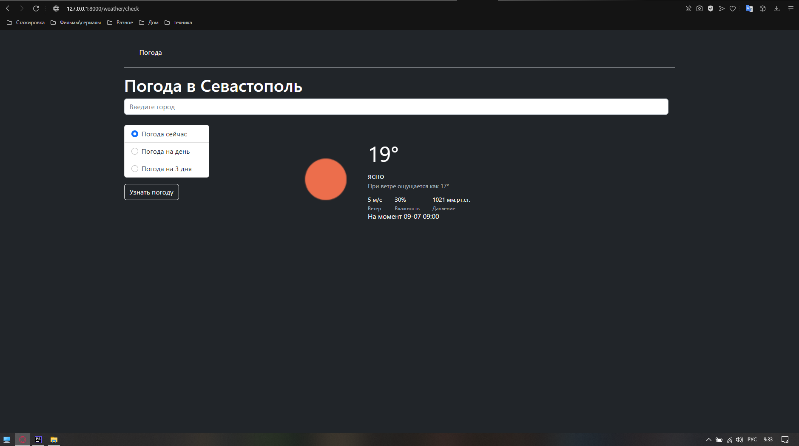

## Настройки .env

API_KEY=75897d3a2c0e5f7d556c2478d69c7856
API_HOST=http://api.openweathermap.org

## Запуск сервера artisan

`php artisan serve`

## Сохранение json файла

Файл сохраняется в public/weather.json

## Внешний вид

